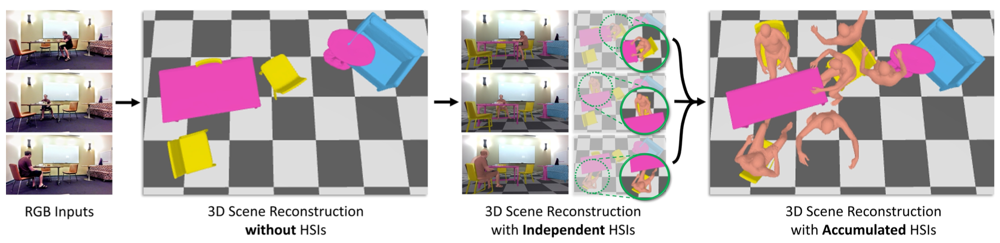
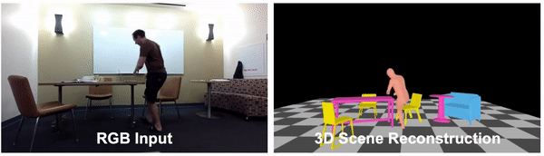

# Human-Aware Object Placement for Visual Environment Reconstruction. (CVPR2022)
<b> </b>
[[Project Page](https://mover.is.tue.mpg.de)] [[Paper](https://openaccess.thecvf.com/content/CVPR2022/papers/Yi_Human-Aware_Object_Placement_for_Visual_Environment_Reconstruction_CVPR_2022_paper.pdf)] [[MPI Project Page](https://ps.is.mpg.de/publications/yi_mover_2022)]
[[Youtube Video](https://youtu.be/waLfe8KiNoY)]

<!--  -->


|                                              |
| :----------------------------------------------------------------------------------------: |
| _3D Scene and Humans Reconstruction Results from a single RGB video_ |


## What Can You Learn from MOVER?

* **3D Scene Initialization** with water-tight mesh (benefit from Total3DUnderstand and OccupancyNet).
* Single Video **Batch-wise SMPLify-X** for single person.
* **Ground-Plane & Camera Orientation Optimization** with human contacted feet.
* Three **HSIs Constraints**: the ordering depth, collision and contact.

<!-- Human-Scene Interactions (HSIs) can 
<br/> Ground-Plane & Camera Orientation Optimization.
<br/> 3D Scene Placement Optimization. -->

<br/>

## Installation

Please follow the [Installation Instruction](docs/Installation.md) to setup all the required packages.

<br/>

## Data
<!-- it stores in /is/cluster/work/hyi/dataset/MOVER_dataset -->

Please register [SMPL-X](https://smpl-x.is.tue.mpg.de/) at first, and then download ```smpl-x_model.tar.gz``` from our [webpage](https://mover.is.tue.mpg.de), put it under ```${MOVER_REPORSITORY}/data/```.

We provide **demo** sequences and MOVER reconstructed humans and 3D scenes of PROX *qualitative* and *quantitative* in our [webpage](https://mover.is.tue.mpg.de).

See more details in [data document](docs/Dataset.md)

<br/>

## Get Started

We provide the core part of MOVER, use three different kinds of HSI constraints (depth, collision, and contact) to help understand the 3D scene. 
<!-- ### TODO

[] Scene Intialization

[] HPS Initialization -->

### Scene optimization with 2D cues and HSIs: 

```
cd ./demo
bash run.sh
```

We also provide the visualization for the final reconstructed 3D scenes and 3D humans.

### Visualize reconstructed 3D humans and 3D scene results:

```
cd ./demo
bash run_rendering.sh
```

### Scene Initialization

See more details in [scene initialization document](docs/Dataset.md)

### HPS Initialization

<!-- and we will also release the scene initialization, HPS Initialization and camera & ground plane optimization soon. -->

<br/>

## Citation

```bibtex
@inproceedings{yi2022mover,
title = {Human-Aware Object Placement for Visual Environment Reconstruction},
author = {Yi, Hongwei and Huang, Chun-Hao P. and Tzionas, Dimitrios and Kocabas, Muhammed and 
  Hassan, Mohamed and Tang, Siyu and Thies, Justus and Black, Michael J.},
booktitle = {Computer Vision and Pattern Recognition (CVPR)},
month = jun,
year = {2022},
month_numeric = {6}}
```

## Acknowledgments
```
We thank Yixin Chen, Yuliang Xiu for the insightful discussions, Yao Feng, Partha Ghosh and
Maria Paola Forte for proof-reading, and Benjamin Pellkofer for IT support. This work was supported by the German Federal Ministry of Education and Research (BMBF): Tubingen AI Center, FKZ: 01IS18039B.
```

## License
This code and model are available for non-commercial scientific research purposes as defined in the [LICENSE](LICENSE) file. By downloading and using the code and model you agree to the terms in the [LICENSE](LICENSE).

## Contact

For more questions, please contact mover@tue.mpg.de

For commercial licensing, please contact ps-licensing@tue.mpg.de