# Requirements
* [detectron2](https://github.com/facebookresearch/detectron2)
* [Total3DUnderstanding](https://github.com/yinyunie/Total3DUnderstanding)
* [OccupancyNet](https://github.com/autonomousvision/occupancy_networks)
* [Manifold](https://github.com/hjwdzh/Manifold)

# Run PointRend

Run all images in ${INPUT_IMAGE_DIR}

```
./detection/run_pointrend_coco.sh ${INPUT_IMAGE_DIR} -1
```

Run specific image frame ${i} in  ${INPUT_IMAGE_DIR}

```
./detection/run_pointrend_coco.sh ${INPUT_IMAGE_DIR} ${i}
```

# Test Total3D

Get a initial 3D reconstructed scene from one single RGB image, which consists of multiple mesh objects.
<!-- /is/cluster/hyi/workspace/HCI/Total3DUnderstanding/run.sh  -->

```
./Total3DUnderstanding/run.sh
```

|            Total3D Results             |                 Occupancy Results                 |
|:--------------------------------:|:------------------------------------------:|
| 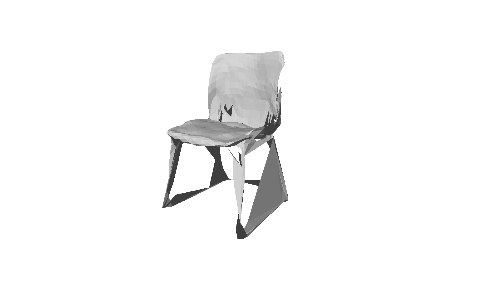 | 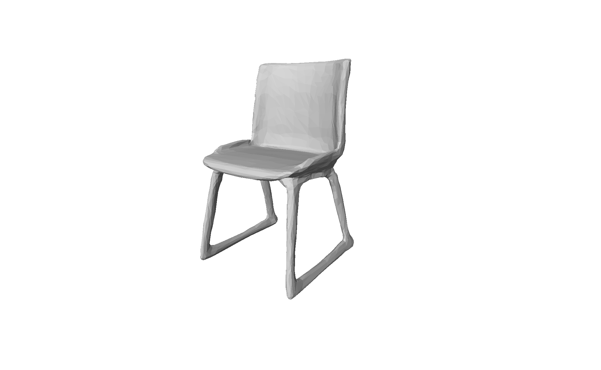 |
| 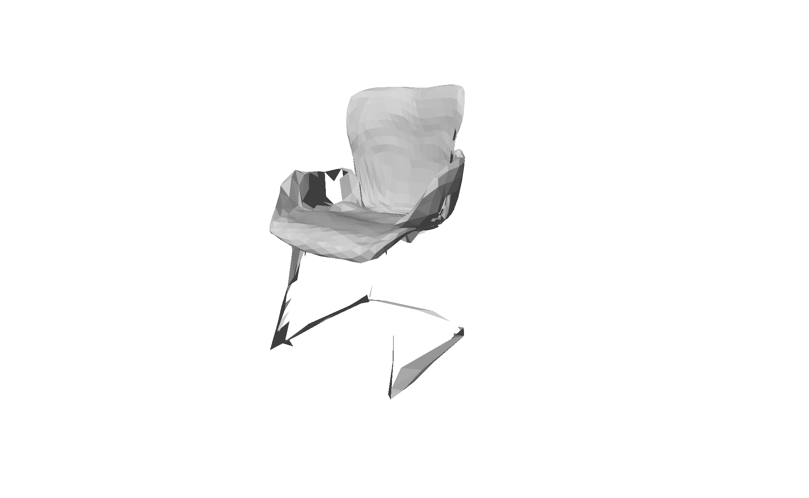 | 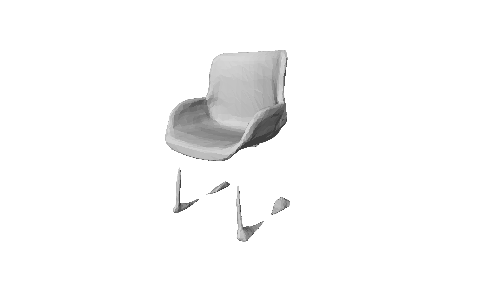 |
| 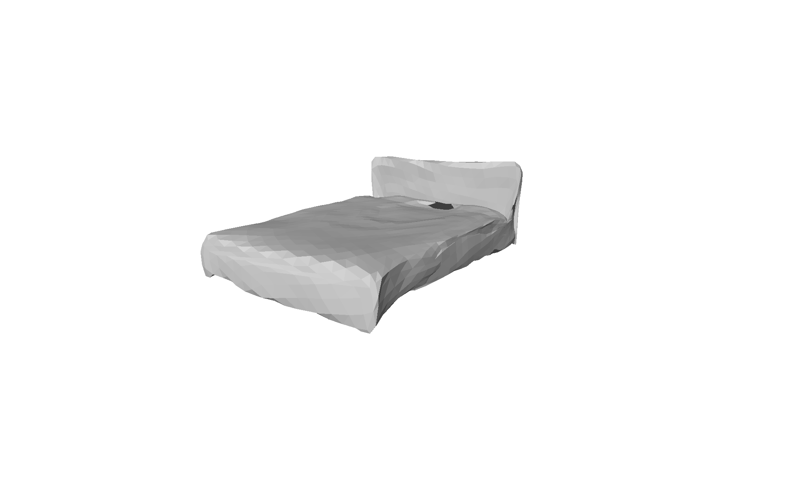 | 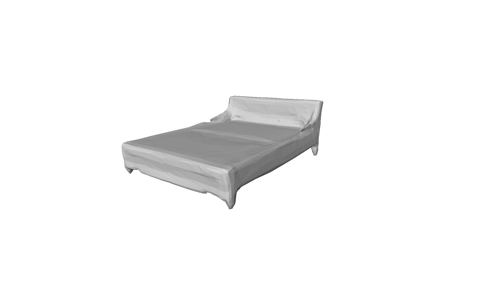 |
| 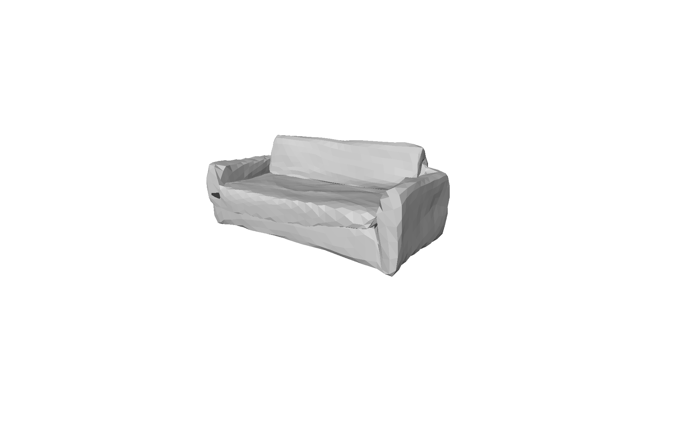 | 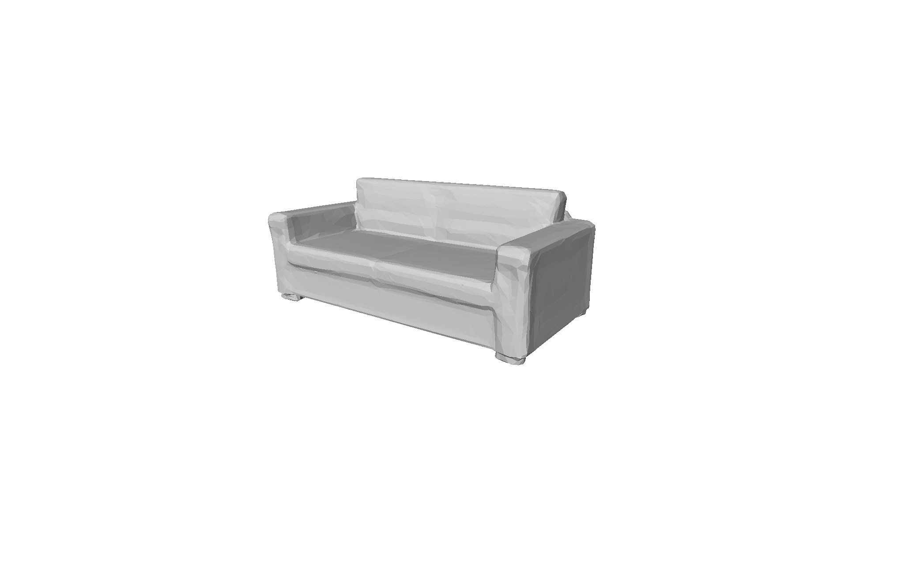 |
| 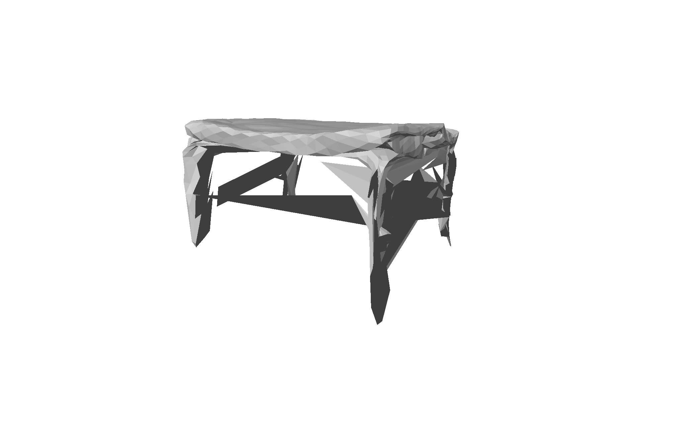 | 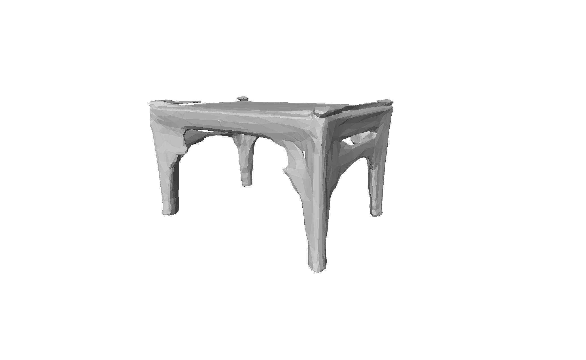 |
| 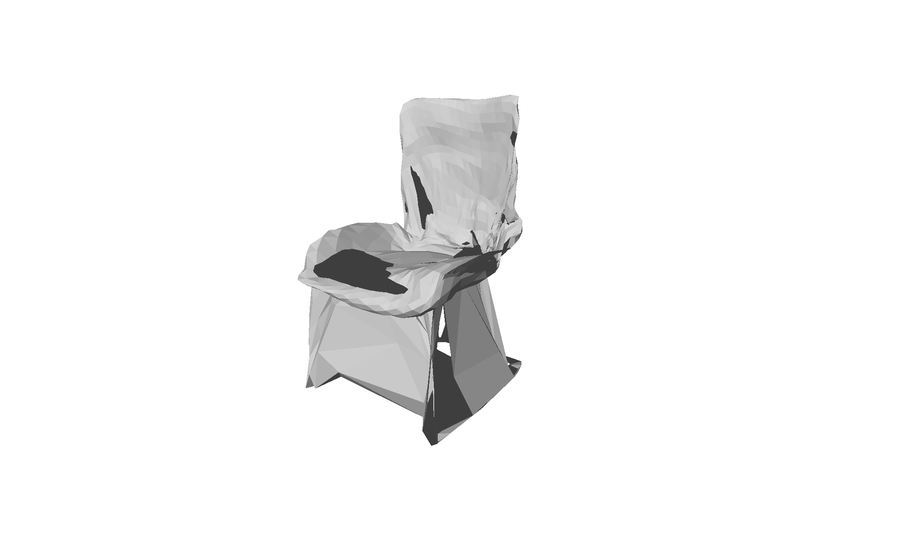 | 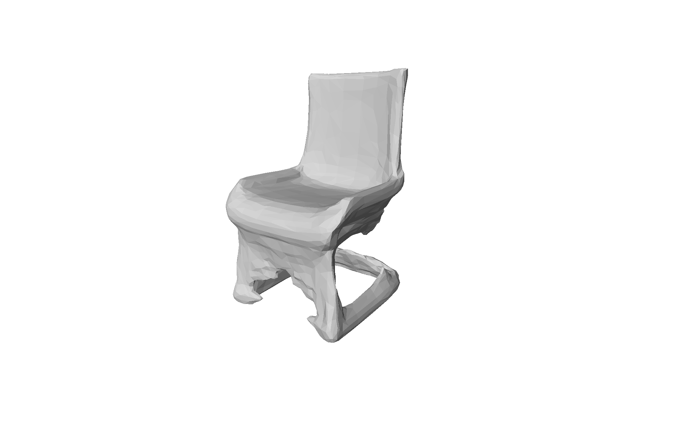 |


# Run OccupancyNet 
Transfer each reconstructed object from Total3DUnderstanding into a water-tight mesh. 

And it also contains the [Manifold/build/simplify](git://github.com/hjwdzh/Manifold) to smplify the water-tight mesh.
please follow the [Manifold/README.md](thirdparty/scene_initialization/Manifold) to build.

```
<!-- /is/cluster/hyi/workspace/Multi-IOI/occupancy_networks/run_label.sh  -->
./occupancy_networks/run_label.sh
```


# Comparison with Implicit3DUnderstanding

We also test 
```
https://github.com/chengzhag/Implicit3DUnderstanding
```
on PROX datset. It does not work well.

|            MPH8             |                 N3OpenArea                 |
|:--------------------------------:|:------------------------------------------:|
| 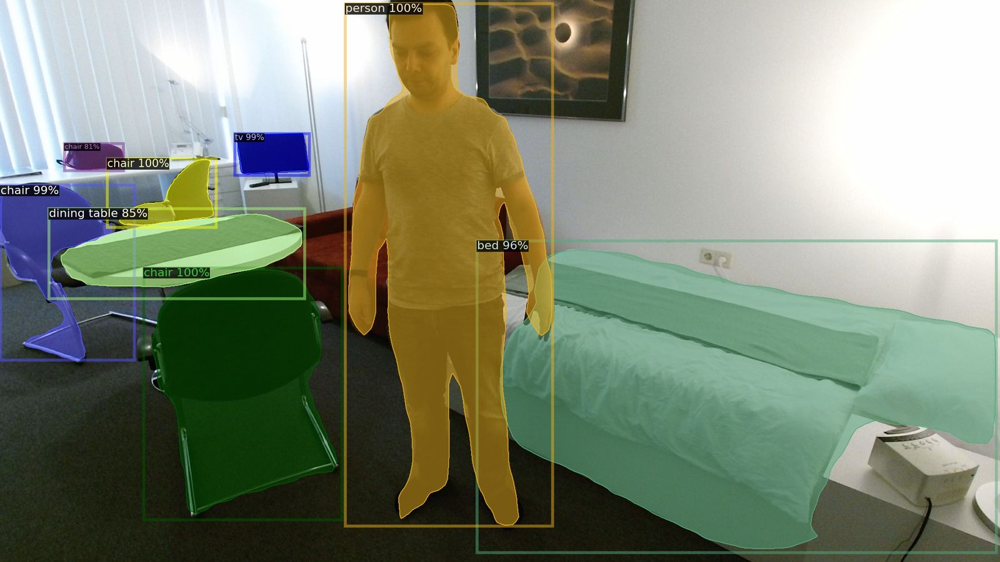 | 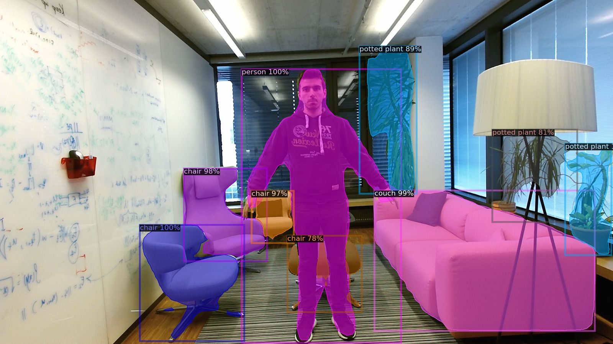 |
|  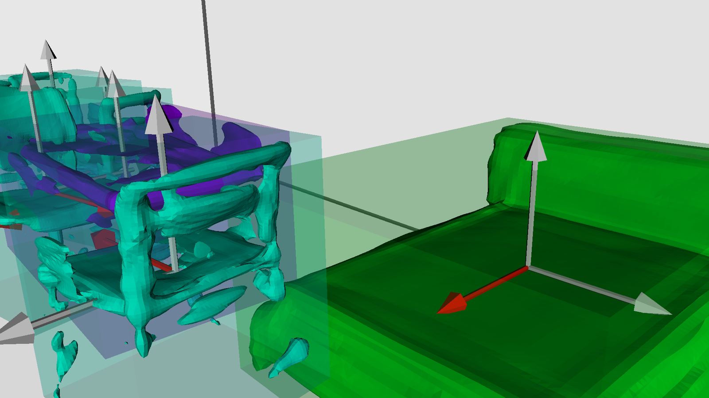   |  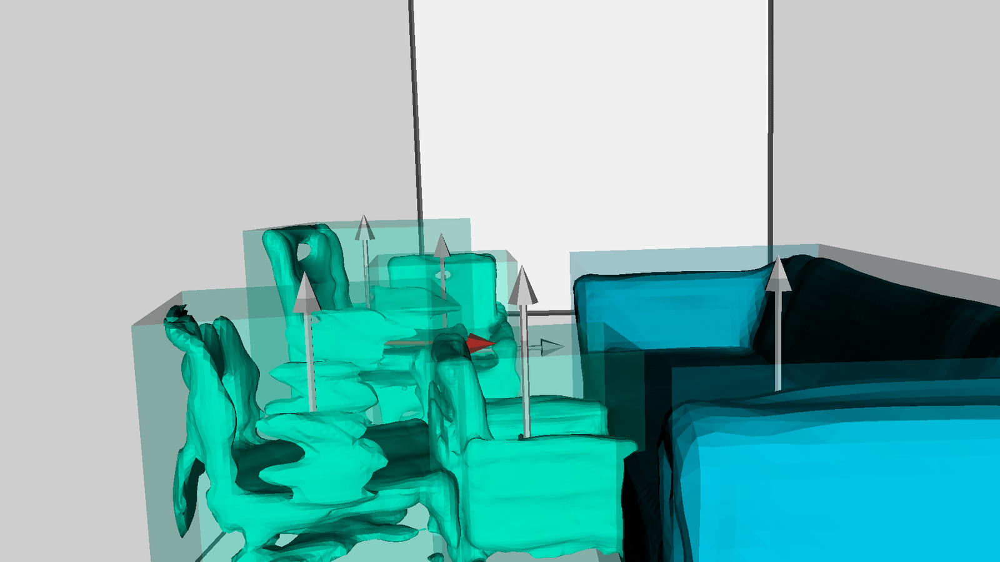   |